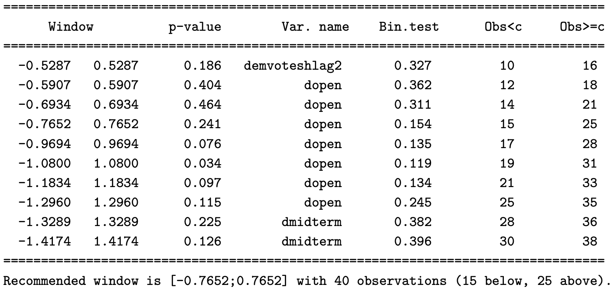

```{r setup, include=FALSE}
options(htmltools.dir.version = FALSE)
knitr::opts_chunk$set(
  fig.path = "figs/class05/"
)
```

<style>
g { color: rgb(0,130,155) }
o { color: rgb(240,138,33) }
</style>


# RDD in Development Economics: Practical Class 05

<u>Today's goal</u>: put in practice *Local Randomization* and *Discrete Score RD*, and *Kink RD* tools

- Also: review missing concepts/tasks from <o>previous classes</o>

<br>

**Material** for this class [<u>here</u>](https://www.dropbox.com/scl/fi/aah7ef6xw3ko3fa126bme/00_practice05.zip?rlkey=3x2075jbji7rbpiwdwj2bsklu&st=lhvcl62n&dl=1).

Installation:

```{r,eval=FALSE}
install.packages('rdlocrand')
```
```{stata,eval=FALSE}
net install rdlocrand, from(https://raw.githubusercontent.com/rdpackages/rdlocrand/master/stata) replace
```

---

<br><br><br><br><br><br>
.center[

# Local Randomization RD

]

---

# Local Randomization RD

Implemented with `rdwinselect` + `rdrandinf` (`rdlocrand` package)

## R version

```{r,eval=FALSE,message=F,warning=F}
rdwinselect(X, C, seed = 50, reps = 1000) # find w window
# why seed and reps? #<<
rdrandinf(Y, X, wl = w, wr = w, seed = 50, reps = 1000)

```
## Stata version
```{stata,eval=FALSE}
rdwinselect X C, seed(50) reps(1000) approx // find w window
rdrandinf Y X, wl(w) wr(w) seed(50)
```

---

<g>Implementation:</g> `rdwinselect` has null hypothesis that covariates are balanced

.center[]

---

# Implementation

<u>Part 1:</u> use `data_cattaneo_localrand.csv`

1\. Replicate the following:

- Local randomization RD with $w = 2.5$

2\. Find optimal $w$ <o>using covariates:</o> `presdemvoteshlag1`, `demvoteshlag1`, `demvoteshlag2`, `demwinprv1`, `demwinprv2`, `dmidterm`, `dpresdem`, `dopen` 

- Results: same as in last slide

3\. <g>Compare point estimates:</g>

- $\tau = 9.167134 \text{ } (w = 2.5)$ versus $\tau = 10.044 \text{ } (\text{optimal }w)$

---

<br><br><br><br><br><br>
.center[

# Discrete Score RD

]

---

# Discrete Score RD

Implemented with either `rdrobust` or `rdrandinf` (depending on how discrete it is)

<u>Part 2:</u> `data_lindo.csv` from Lindo et al. (2010): "*Ability, Gender, and Performance Standards: Evidence from Academic Probation*"

Show that RD results (with either tools) are <g>almost equivalent</g>

- Raw data

- Aggregated/collapsed data *by mass point*

---

```{r, echo=FALSE,message=F,warning=F, out.width="90%"}
library(rdrobust)
dset <- read.csv('data_lindo.csv')
summary(rdrobust(dset$nextGPA,dset$X))
```

---

```{r, echo=FALSE,message=F,warning=F, out.width="90%"}
library(rdrobust)
dset <- read.csv('data_lindo.csv')
dset <- aggregate(nextGPA ~ X, data = dset, mean)
summary(rdrobust(dset$nextGPA,dset$X))
```

---

# Kink RD

.pull-left[
<u>Part 3:</u> Lalive (2008) (`data_lalice.csv`) with `unemployment_duration` as outcome

- Can you <g>transform the RD discontinuity into a Kink</g>?

- Can you estimate $\tau_{KRD}$?
]
.pull-right[
```{r, echo=FALSE,message=F,warning=F, out.width="90%"}
library(rdrobust)
dset <- read.csv('data_lalive.csv')
rdplot(dset$unemployment_duration, dset$age-50)
```
]

---

# Kink RD

.pull-left[

<u>Part 3:</u> Lalive (2008) (`data_lalice.csv`) with `unemployment_duration` as outcome

- Can you <g>transform the RD discontinuity into a Kink</g>?

- Can you estimate $\tau_{KRD}$?
]
.pull-right[
```{r, echo=FALSE,message=F,warning=F, out.width="90%"}
dset2 <- dset
dset2[dset$age>=50,'unemployment_duration'] <- dset2[dset$age>=50,]$unemployment_duration - rdrobust(dset$unemployment_duration, dset$age-50)$coef[1]
rdplot(dset2$unemployment_duration, dset2$age-50)
```
]

---

<br><br><br><br><br><br>
.center[
# Thank you! :)
]

---

# References

- Lalive, R., 2008. How do extended benefits affect unemployment duration? A regression discontinuity approach. *Journal of econometrics*, 142(2), pp.785-806.

- Meyersson, E., 2014. Islamic Rule and the Empowerment of the Poor and Pious. *Econometrica*, 82(1), pp.229-269.


